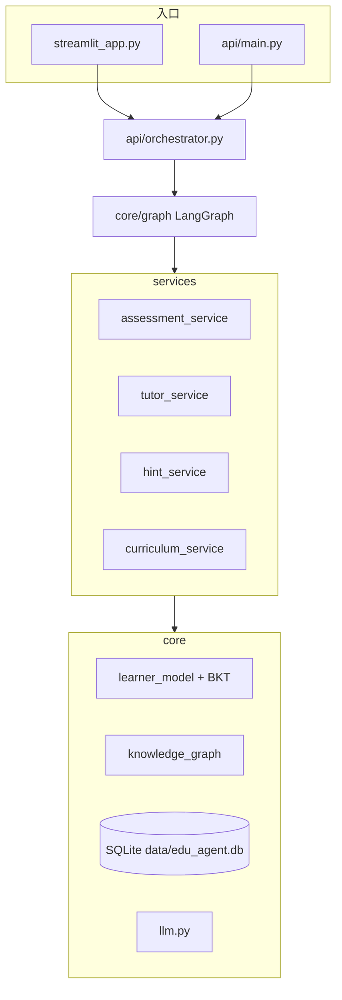

# 多 Agent 智能教育系统

基于 **LangGraph** 的个性化数学学习系统：根据答题与提问更新掌握度（BKT），经状态图编排评估、教学、分级提示与课程规划，并支持 SM-2 间隔复习与拍照错题本。

**推荐入口**：`streamlit run streamlit_app.py`（直连 `AgentOrchestrator`）。可选启动 FastAPI 做 HTTP / WebSocket 集成。

---

## 功能概览

| 模块 | 说明 |
|------|------|
| 学习聊天 | 苏格拉底式引导，保留对话上下文 |
| 答题练习 | 判题后更新掌握度，按策略进入教学或分级提示 |
| 学习进度 | 薄弱/强项、知识图谱、学习历史 |
| 系统监控 | 学习者各知识点掌握度分布与请求 Trace |
| 错题本 | 拍照 OCR、错因标注、变式练习（需配置百度 OCR） |
| 复习计划 | SM-2 到期复习与路径推荐 |

---

## 架构

业务逻辑分为三层：**编排器** → **LangGraph 节点** → **services 服务**。节点只做编排与观测，具体能力由 `services/` 与 `core/` 模块实现。



### LangGraph 流程

节点定义见 [`core/graph/builder/learning_graph_builder.py`](core/graph/builder/learning_graph_builder.py)。

**提交答案**（`is_correct` 有值）：

```text
assess ──► teach | hint_node | END
teach / hint_node ──► plan_curriculum ──► explain ──► END
```

**提问**（无判题，仅对话）：

```text
assess ──► teach ──► plan_curriculum ──► explain ──► END
```

`assess` 之后的路由（[`services/assessment_service.py`](services/assessment_service.py)）：

- `attempts ≥ 2` 且 `mastery < low_mastery_threshold`（默认 `0.15`）→ `hint`
- 否则 → `teach`
- 其他情况 → `END`

| 路径 | 职责 |
|------|------|
| [`api/`](api/) | FastAPI 路由、编排器、WebSocket |
| [`core/graph/`](core/graph/) | `LearningState`、节点、路由、图构建 |
| [`services/`](services/) | 评估 / 教学 / 提示 / 课程规划 |
| [`core/`](core/) | BKT 学习者模型、知识图谱、SQLite、LLM、OCR、错题本、可观测性 |

---

## 项目结构

```text
multi-agent-education/
├── api/
│   ├── main.py              # FastAPI 应用
│   ├── orchestrator.py      # 统一编排入口
│   ├── routes.py            # REST 路由
│   └── websocket.py         # WebSocket（若启用）
├── config/
│   └── settings.py          # 环境变量与算法参数
├── core/
│   ├── graph/               # LangGraph 状态、节点、路由、builder
│   ├── database.py          # SQLite 持久化
│   ├── knowledge_graph.py
│   ├── learner_model.py
│   ├── learner_model_manager.py
│   ├── spaced_repetition.py
│   ├── llm.py
│   ├── ocr.py
│   ├── wrong_question_manager.py
│   └── observability.py
├── services/                # assessment / tutor / hint / curriculum
├── streamlit_app.py         # 主界面（推荐）
├── tests/
├── docs/                    # 部署与知识点说明（见下文）
├── data/                    # 运行时生成 edu_agent.db
├── requirements.txt
├── .env.example
└── .github/workflows/ci.yml
```

持久化默认使用 **SQLite**（[`core/database.py`](core/database.py) → `data/edu_agent.db`）。`.env.example` 中的 `DATABASE_URL` / `REDIS_URL` 为预留配置，当前主流程不依赖 PostgreSQL / Redis。

---

## 快速开始

### 环境要求

- Python **3.11+**
- LLM：通义千问 / OpenAI / MiniMax 等（见 [`.env.example`](.env.example)）
- OCR（可选）：百度 OCR，用于错题拍照

### 安装

```bash
git clone <your-repo-url>
cd multi-agent-education

python -m venv venv
# Windows:  venv\Scripts\activate
# Linux/macOS:  source venv/bin/activate

pip install -r requirements.txt
pip install streamlit-agraph   # 知识图谱页可选依赖

cp .env.example .env
# 至少配置一种 LLM，例如：
# DASHSCOPE_API_KEY=your-key
# DASHSCOPE_MODEL=qwen-turbo
```

### 启动 Streamlit（推荐）

```bash
streamlit run streamlit_app.py
```

浏览器访问 <http://localhost:8501>。侧边栏可切换学习者 ID 与当前知识点。

### 启动 FastAPI（可选）

```bash
python -m uvicorn api.main:app --reload --host 0.0.0.0 --port 8000
```

- 交互文档：<http://localhost:8000/docs>
- 健康检查：`GET /api/v1/health`

更细的部署步骤见 [`docs/deployment.md`](docs/deployment.md)。

---

## HTTP API

前缀：`/api/v1`

### 学习与编排

| 方法 | 路径 | 说明 |
|------|------|------|
| POST | `/submit` | 提交答题（`is_correct`、`time_spent_seconds`、可选 `error_type`） |
| POST | `/question` | 针对当前知识点提问 |
| POST | `/message` | 通用消息（默认知识点 `general`） |
| GET | `/progress/{learner_id}` | 学习进度 |
| GET | `/review-plan/{learner_id}` | SM-2 复习计划 |

### 监控

| 方法 | 路径 | 说明 |
|------|------|------|
| GET | `/monitor/summary` | 汇总指标 |
| GET | `/monitor/trace/{trace_id}` | 单次请求 Trace |

### 错题本

| 方法 | 路径 | 说明 |
|------|------|------|
| POST | `/wrong-question/upload` | 上传错题图片 |
| POST | `/wrong-question/upload-base64` | Base64 上传 |
| GET | `/wrong-questions/{learner_id}` | 错题列表 |
| GET | `/wrong-question/{question_id}` | 单条错题 |
| GET | `/wrong-questions/count/{learner_id}` | 错题数量 |
| POST | `/wrong-question/{question_id}/practice` | 变式练习 |
| DELETE | `/wrong-question/{question_id}` | 删除错题 |

### 结构化响应

`submit` / `question` / `message` 返回统一结构（契约见 [`tests/test_response_schema.py`](tests/test_response_schema.py)）：

```json
{
  "response": "教学或提示文本",
  "mastery": 0.42,
  "next_action": "end",
  "curriculum": {
    "next_topic": "algebra_basics",
    "review_due": false,
    "learning_path_reason": "前置知识已掌握，推荐学习「代数基础」"
  },
  "trace_id": "550e8400-e29b-41d4-a716-446655440000"
}
```

无路径建议时：`review_due` 为 `false`，`next_topic` 与 `learning_path_reason` 为空字符串。

---

## 配置

主要项在 [`config/settings.py`](config/settings.py)，通过 `.env` 覆盖（变量名不区分大小写）：

| 变量 | 说明 | 默认 |
|------|------|------|
| `DASHSCOPE_API_KEY` | 通义千问 Key | — |
| `DASHSCOPE_MODEL` | 模型名 | `qwen-turbo` |
| `OPENAI_API_KEY` / `MINIMAX_API_KEY` | 其他 LLM 提供商 | — |
| `low_mastery_threshold` | 触发 hint 的掌握度上限 | `0.15` |
| `mastery_threshold` | 视为已掌握（路径推荐） | `0.6` |
| `BAIDU_OCR_API_KEY` / `BAIDU_OCR_SECRET_KEY` | 错题 OCR | — |

---

## 测试

```bash
python -m pytest tests/ -v
```

测试覆盖图路由、服务契约、API 响应结构与错题本回归等。CI 配置见 [`.github/workflows/ci.yml`](.github/workflows/ci.yml)。

---

## 相关文档

仅列出仓库内**已有内容**的文档：

| 文档 | 内容 |
|------|------|
| [`docs/deployment.md`](docs/deployment.md) | 本地部署（Streamlit / FastAPI） |
| [`docs/knowledge-points.md`](docs/knowledge-points.md) | 示例知识图谱与知识点 ID |
| [`docs/interview-guide.md`](docs/interview-guide.md) | 面试笔记（**部分章节仍描述旧的 5-Agent / EventBus 架构，仅供面试话术参考，勿与当前代码一一对应**） |

---

## 技术栈

LangGraph · FastAPI · Streamlit · SQLite · NetworkX · BKT · SM-2 · OpenAI 兼容 LLM 接口 · Plotly（进度可视化）

---
